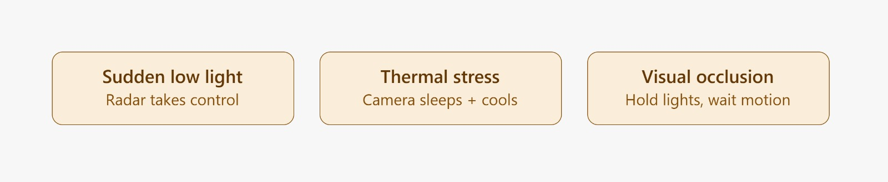
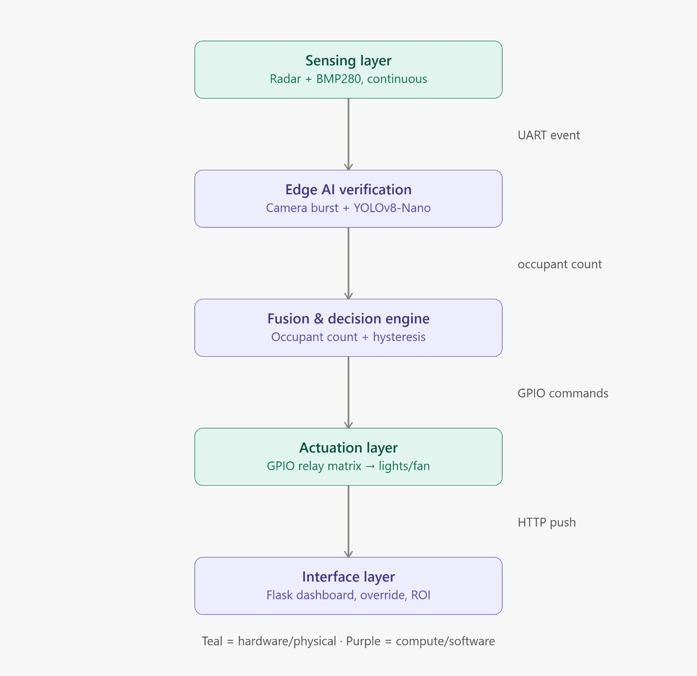

<div align="center">

# AEGIS-Eco

**A privacy-first edge device that watches a room breathe, and only spends energy when someone's actually there.**

Built by **Team Techtides** for SOCF 2.0.


</div>

---

## Table of contents

- [The problem](#the-problem)
- [The idea](#the-idea)
- [Screenshot](#screenshot)
- [How it thinks](#how-it-thinks)
- [Features](#features)
- [Tech stack](#tech-stack)
- [Getting started](#getting-started)
- [Running on the actual Raspberry Pi (kiosk mode)](#running-on-the-actual-raspberry-pi-kiosk-mode)
- [Wiring the hardware](#wiring-the-hardware)
- [Decision logic](#decision-logic)
- [API reference](#api-reference)
- [Configuration reference](#configuration-reference)
- [Project structure](#project-structure)
- [Known limitations](#known-limitations)
- [Roadmap](#roadmap)
- [Contributing](#contributing)
- [License](#license)
- [Team Techtides](#team-techtides)

---

## The problem

Empty classrooms and offices burn electricity for hours because dumb PIR sensors either miss people sitting still (reading, in an exam) or can't tell the difference between 1 person and 40 — so buildings run fans, lights, and AC at one fixed setting no matter who's actually in the room.

## The idea

AEGIS-Eco watches a room with an on-device camera pipeline to know whether anyone is actually present, then switches lighting and a fan to match — entirely on the edge, with zero video ever leaving the room.

This repository holds the **backend brain, the occupancy-sensing node, and the web dashboard**: the Flask service that turns sensor readings into device decisions, the camera script that counts people, and the live console that lets admins watch it all happen.

---

## Screenshot

![AEGIS-Eco dashboard]


*Live occupant count, indoor/outdoor temperature, humidity, a running ₹ savings estimate, and per-device Force ON / Auto / Force OFF controls.*

---

## How it thinks

```
                                                   ┌─────────────┐
 Pi Camera ──► motion gate ──► YOLOv8n ──► occupant_count ──►│             │
 (camera_node.py: sleeps until it sees movement,             │             │
  only then runs the heavy model)                            │  Flask      │──► Relays
                                                               │  Brain      │    fan / light 1 / light 2
 BMP280 (indoor temp, on this Pi) ─────────────────────────►  │  (app.py)   │
                                                               │             │
 OpenWeatherMap (outdoor temp + humidity) ─────────────────►  └─────────────┘
                                                                     │
                                                                     ▼
                                                          ┌────────────────────┐
                                                          │  Web Dashboard      │
                                                          │  live state, override,
                                                          │  ₹ savings tracker  │
                                                          └────────────────────┘
```

Two flowcharts from the original design pass, kept here for reference:

<table>
<tr>
<td></td>
<td></td>
</tr>
</table>

**Sensor-less by design, when it has to be:** every input has a mock/fallback path, so the whole system runs and shows real numbers on a laptop with zero hardware attached — useful for development, and for judges who want to see the logic work without wiring anything up.

---

## Features

- 📷 **On-edge occupancy counting** — a lightweight motion gate wakes a YOLOv8-Nano model only when something moves in frame, so the Pi isn't running a full object-detection pass on every single frame
- 🕒 **Occupancy grace window** — a room isn't declared "empty" the instant one frame misses a detection; a 16-second grace period smooths out blips from someone turning away or a brief occlusion
- 🌡️ **Dual temperature sourcing** — a real indoor reading from a BMP280, a real outdoor reading from a live weather API, refreshed every 2 seconds
- 💡 **Occupancy-driven automation** — fan and both lights track whether the room is occupied, with per-device manual override
- 🎛️ **Manual override with auto-revert** — force any device on or off from the dashboard; forcing something ON while the room is empty starts an auto-revert timer so nobody has to remember to switch it back
- 💰 **Live ROI tracker** — a running ₹ estimate of money saved vs. an "everything ran the whole time" baseline, resettable on demand
- 🔒 **Zero-cloud** — everything runs on a local Flask server; no video or personal data ever leaves the device
- 🧪 **Fully demoable without hardware** — every sensor has a graceful mock fallback, and `mock_sensor.py` can simulate an empty room, a packed room, or people trickling in
- 🖥️ **Kiosk-ready** — `launch.sh` boots the backend, the camera node, and a fullscreen Chromium dashboard automatically on Pi startup

---

## Tech stack

| Layer | Technology |
|---|---|
| Core hardware | Raspberry Pi 5 |
| Indoor sensor | BMP280 (I2C) |
| Outdoor data | OpenWeatherMap API |
| Occupancy sensing | Pi Camera + OpenCV motion gate + YOLOv8-Nano (Ultralytics) |
| Backend | Python 3.x, Flask |
| Frontend | HTML5, CSS3, vanilla JavaScript |
| Actuation | Relay board (fan, light 1, light 2) via `gpiozero` |
| Kiosk display | Chromium in `--kiosk` mode, launched by `launch.sh` |

---

## Getting started

These steps run the backend + dashboard on any laptop, using mocked sensor data — no Pi or hardware required.

### 1. Clone and install dependencies
```bash
git clone <this-repo-url>
cd Team-Techtides-Shreya-main
pip install -r requirements.txt
```
> `requirements.txt` includes everything, including Pi-only packages (`gpiozero`, `bmp280`, `smbus2`) and camera-node packages (`ultralytics`, `opencv-python`). Those hardware packages either aren't needed off-Pi or fail to *import* gracefully — `app.py` catches that and drops into mock mode automatically, so it's safe to install the whole file anywhere.

### 2. Set up your weather API key
```bash
cp .env.example .env
```
Then open `.env` and fill in your key:
```
OPENWEATHER_API_KEY=your_key_here
```
Get a free key at [openweathermap.org/api](https://openweathermap.org/api) (can take up to an hour to activate). `.env` is gitignored — never commit your real key.

No key yet, or the API is unreachable? `app.py` detects this and mirrors outdoor temperature to the indoor reading instead of showing a stale or fake number, and the dashboard flags it clearly.

### 3. Set your location
In `app.py`, update:
```python
LATITUDE = 23.073212
LONGITUDE = 76.855446
```
to your room's actual coordinates, so the weather API reports the right local conditions.

### 4. Run the backend
```bash
python app.py
```
You should see:
```
Relay hardware mode: False
BMP280 hardware mode: False
```
That's expected on a laptop — it means the mock fallbacks kicked in correctly.

### 5. Feed it some occupancy data
In a **second terminal**, either simulate people:
```bash
python mock_sensor.py
```
Open `mock_sensor.py` and change `SCENARIO` to `"empty"`, `"packed"`, `"trickle_in"`, or leave it as `"random"`.

...or, if you have a webcam and want the real pipeline:
```bash
python camera_node.py
```

### 6. Open the dashboard
```
http://127.0.0.1:5000
```

---

## Running on the actual Raspberry Pi (kiosk mode)

`launch.sh` is meant to run automatically on Pi boot (e.g. via a desktop autostart entry or a systemd service). It:

1. Sets the display for graphical output
2. Activates a Python virtual environment with YOLO installed
3. Starts `app.py` in the background, logging to `backend_error.log`
4. Starts `camera_node.py` (via `libcamerify`, needed for the Pi's camera stack) in the background, logging to `camera_error.log`
5. Waits 10 seconds for both servers to come up
6. Launches Chromium fullscreen (`--kiosk`) pointed at the local dashboard

Before using it as-is, update the two hardcoded paths near the top to match your Pi:
```bash
cd /home/raspberrypi/smart_room                       # your project folder
source /home/raspberrypi/yolo_object/bin/activate      # your venv
```

Make it executable once:
```bash
chmod +x launch.sh
```

---

## Wiring the hardware

### BMP280 (indoor temperature, I2C)

| BMP280 pin | Pi pin |
|---|---|
| VCC | 3.3V |
| GND | GND |
| SCL | GPIO3 (pin 5) |
| SDA | GPIO2 (pin 3) |

Enable I2C first: `sudo raspi-config` → Interface Options → I2C → Enable → reboot.

No sensor wired up yet? No problem — `app.py` automatically falls back to a mock reading so development and testing aren't blocked.

### Relay board (fan, light 1, light 2)

| Device | GPIO pin (BCM) |
|---|---|
| Fan | 17 |
| Light 1 | 27 |
| Light 2 | 22 |

Most common relay boards (the cheap blue 1/2/4-channel modules) are **active-low**: the relay energizes when the GPIO pin goes LOW, not HIGH. `app.py` assumes this by default (`RELAY_ACTIVE_HIGH = False`). If your board is the opposite — appliance turns on exactly when you expect it to be off — flip that one line to `True` and restart.

No relay board wired up? Same story — every `set_relay()` call just prints `[MOCK RELAY] FAN -> ON` instead of touching GPIO, so the full decision logic and dashboard are demoable with zero hardware attached.

---

## Decision logic

| Device | Logic |
|---|---|
| **Fan** | Follows room occupancy directly — on whenever the room is occupied, off when it isn't. |
| **Light 1 / Light 2** | Same rule — on whenever `occupant_count > 0`. |
| **Occupancy itself** | Not just the latest reading — if the sensor reports 0 people, the room is still treated as occupied for up to `OCCUPANCY_GRACE_SECONDS` (16s) after the last positive reading, so one bad frame doesn't flicker every device off and back on. |
| **Any device** | Can be force-overridden from the dashboard (on or off), and holds indefinitely — *except* a forced-ON device automatically starts a revert-to-auto countdown as soon as the room goes empty, so nobody has to remember to turn it back off. |

---

## API reference

All endpoints are served by `app.py` on `http://127.0.0.1:5000`.

| Endpoint | Method | Purpose | Body |
|---|---|---|---|
| `/` | GET | Serves the dashboard | — |
| `/api/config` | GET | Static config the dashboard needs (thresholds, energy price) | — |
| `/api/state` | GET | Full current state — occupancy, temps, device states, overrides, savings | — |
| `/api/sensor-update` | POST | Occupancy pipeline pushes the latest count here | `{"occupant_count": 7}` |
| `/api/override` | POST | Force a device on/off | `{"device": "fan", "state": true, "duration_minutes": 30}` |
| `/api/override/cancel` | POST | Cancel an active override, hand control back to auto | `{"device": "fan"}` |
| `/api/savings/reset` | POST | Zero out the ROI savings counter and restart tracking from now | — |

`device` must be one of `"fan"`, `"light_1"`, `"light_2"`.

<details>
<summary>Example: <code>GET /api/state</code> response</summary>

```json
{
  "occupant_count": 7,
  "indoor_temperature": 27.9,
  "outdoor_temperature": 27.9,
  "humidity": 50.0,
  "weather_available": false,
  "fan_on": true,
  "light_1_on": true,
  "light_2_on": true,
  "last_occupancy_update": "2026-07-31T05:40:12.123456+00:00",
  "last_weather_update": null,
  "weather_error": "No OPENWEATHER_API_KEY found",
  "overrides": {
    "fan": { "active": false, "expires_at": null, "duration_minutes": null },
    "light_1": { "active": false, "expires_at": null, "duration_minutes": null },
    "light_2": { "active": false, "expires_at": null, "duration_minutes": null }
  },
  "savings": {
    "tracking_since": "2026-07-31T05:30:00.000000+00:00",
    "energy_used_kwh": 0.0052,
    "energy_baseline_kwh": 0.0086,
    "energy_saved_kwh": 0.0034,
    "cost_saved": 0.03
  }
}
```
</details>

No authentication is currently required on any endpoint — see [Known limitations](#known-limitations).

---

## Configuration reference

Tunable constants live at the top of `app.py`:

| Constant | Default | What it controls |
|---|---|---|
| `LATITUDE`, `LONGITUDE` | Set to your location | Coordinates OpenWeatherMap reports on |
| `WEATHER_POLL_SECONDS` | `600` (10 min) | How often outdoor weather is refreshed |
| `TICK_SECONDS` | `2` | How often the control loop re-evaluates devices and updates savings |
| `OCCUPANCY_GRACE_SECONDS` | `16.0` | How long the room stays "occupied" after the last positive reading |
| `RELAY_PINS` | `{fan: 17, light_1: 27, light_2: 22}` | GPIO (BCM) pin per device |
| `RELAY_ACTIVE_HIGH` | `False` | Flip to `True` if your relay board is active-high |
| `APPLIANCE_WATTS` | `{fan: 75, light_1: 20, light_2: 20}` | Wattage assumptions used for the savings estimate — edit to match your real hardware |
| `ENERGY_PRICE_PER_KWH` | `8.0` | ₹/kWh used to convert savings into rupees |
| `FLASK_DEBUG` (env var) | `false` | Whether Flask runs with debug/auto-reload on — keep `false` off your own laptop |

---

## Project structure

```
.
├── app.py                       # Flask backend — state, decision logic, API, relay + BMP280 drivers
├── camera_node.py               # Occupancy pipeline: motion gate -> YOLOv8n -> POSTs to /api/sensor-update
├── mock_sensor.py               # Simulates occupancy data for dev/testing, no camera needed
├── dashboard.html               # Live web console (single-file HTML/CSS/JS)
├── launch.sh                    # Pi boot script: starts backend + camera node + kiosk-mode Chromium
├── requirements.txt             # All Python dependencies (backend + camera node + hardware)
├── .env.example                 # Template for your weather API key — copy to .env
├── .gitignore
├── Image/
│   ├── Flowchart_1.jpeg         # Design-phase system flowchart
│   ├── Flowchart_2.jpeg         # Design-phase decision-flow flowchart
│   └── dashboard_screenshot.png # Live dashboard, used above
└── README.md
```

---

## Known limitations

Being upfront about these now is a lot better than a judge or a new contributor finding them first:

- **No authentication on write endpoints.** `/api/override`, `/api/sensor-update`, and `/api/savings/reset` are open POST endpoints — fine on a closed demo network, not fine on a real deployment. Add an API key or session check in front of them before going further than a hackathon.
- **State is in-memory only.** Restarting `app.py` wipes device state, override state, and the savings counters. Nothing is persisted to disk. For a production version, persist `state["savings"]` (and ideally the rest) to SQLite or similar.
- **Fan temperature hysteresis isn't actually wired in** (see [Decision logic](#decision-logic) above) — the constants exist, the dashboard displays a "band," but no device decision currently checks temperature at all.
- **`camera_node.py`'s occupancy count is a same-frame headcount, not tracked identity** — it re-runs YOLO on the current frame every wake cycle and returns however many people are in that frame; it doesn't track individuals across frames or handle re-entry/occlusion beyond the grace-window smoothing described above.
- **Appliance wattages are estimates, not measured values.** `APPLIANCE_WATTS` in `app.py` are reasonable placeholders — for an accurate ₹ savings figure, replace them with your actual hardware's rated (or better, measured) wattage.
- **Flask's dev server isn't production-grade.** `app.run(...)` is fine for a demo; a real deployment should sit behind a proper WSGI server (gunicorn, waitress) rather than Flask's built-in one.
- **Single room per instance.** State, relay pins, and the camera pipeline all assume one Flask process controls exactly one room. Multi-room would need either one Pi + one instance per room reporting to a central dashboard, or a refactor to key `state` by room ID.

---

## Roadmap

- [ ] Re-wire (or remove) the unused temperature-hysteresis constants so the fan logic and the pitch agree
- [ ] Add authentication to the override/reset/sensor-update endpoints
- [ ] Persist state + savings history to a lightweight database so a restart doesn't lose progress
- [ ] Multi-room support with a central aggregating dashboard
- [ ] Swap placeholder `APPLIANCE_WATTS` for real measured values (or live current-sensor readings)
- [ ] Historical savings graph, not just a running total

---

## Future scope

The roadmap above is near-term — things that make the current system correct and demo-ready. This section is the longer-term vision: where AEGIS-Eco could go if it grew past a single-room hackathon build.

- **Real mmWave radar fusion** — pair the existing camera pipeline with an actual 24GHz radar module (breathing/micro-motion detection) so occupancy still works in low light, through partial camera occlusion, or when someone's sitting still enough that motion-gating alone would miss them.
- **Campus-scale deployment** — one Pi per room reporting into a central dashboard/database, so a facilities team can see every room's occupancy, energy use, and savings from a single screen instead of walking to each panel.
- **Predictive control, not just reactive** — use historical occupancy patterns (e.g. "this lecture hall is always full 9–11am on Tuesdays") to pre-cool or pre-light a room slightly ahead of expected arrival, instead of reacting only after someone's already detected.
- **Integration with existing Building Management Systems (BMS)** — expose AEGIS-Eco's state over a standard protocol (e.g. MQTT, BACnet) so it can plug into whatever a building already runs, rather than only working standalone.
- **Mobile app / push notifications** — a lightweight companion app for facilities staff, so overriding a device or checking a room's status doesn't require being on the same network as the dashboard.
- **Solar/renewable-aware scheduling** — if a building has solar panels or time-of-use electricity pricing, shift discretionary loads (e.g. pre-cooling) toward periods of cheap/renewable power instead of only reacting to occupancy.
- **Fine-grained AC control** — reintroduce AC as a controlled device (it was part of an earlier version of this system) with proper compressor-safe minimum-off-time logic, once the occupancy-scaling approach is validated on fan/light alone.
- **Anomaly + fault detection** — flag a device that was commanded on/off but doesn't seem to be drawing power (via a current sensor), so a broken relay or bulb gets reported instead of silently failing.
- **Multi-tenant / SaaS packaging** — turn this from "one repo per deployment" into a proper multi-room, multi-building product with per-organization dashboards and auth, for institutions that want this across many sites at once.

---

## Contributing

This started as a hackathon build for SOCF 2.0, but improvements are welcome.

1. Fork the repo and create a branch: `git checkout -b feature/your-idea`
2. Make your changes — if you touch `app.py`, sanity-check with `python -m py_compile app.py` and a quick manual run before opening a PR
3. Keep hardware-optional: any new sensor or actuator should follow the existing pattern of a try/except import with a mock fallback, so the project still runs on a laptop with nothing plugged in
4. Open a pull request describing what changed and why

---

## License

No license has been specified for this repository yet. Until one is added, all rights are reserved by default — if you intend for others to reuse or build on this project, consider adding an [MIT](https://choosealicense.com/licenses/mit/) or [Apache 2.0](https://choosealicense.com/licenses/apache-2.0/) license (both are common, permissive choices for hackathon projects).

---

## Team Techtides

Built for SOCF 2.0.
